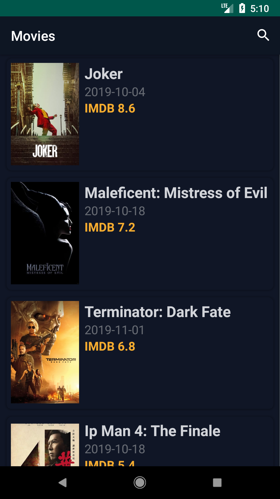
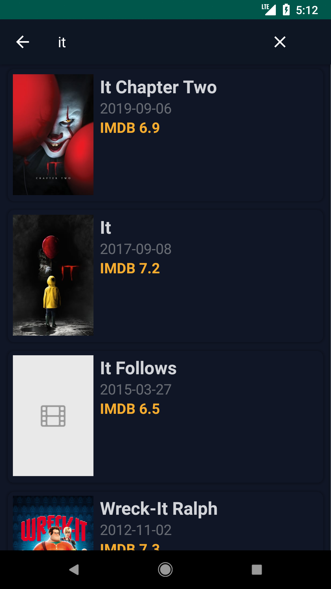
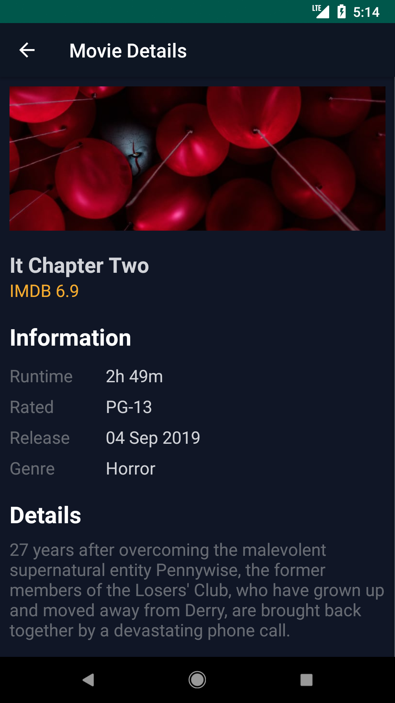
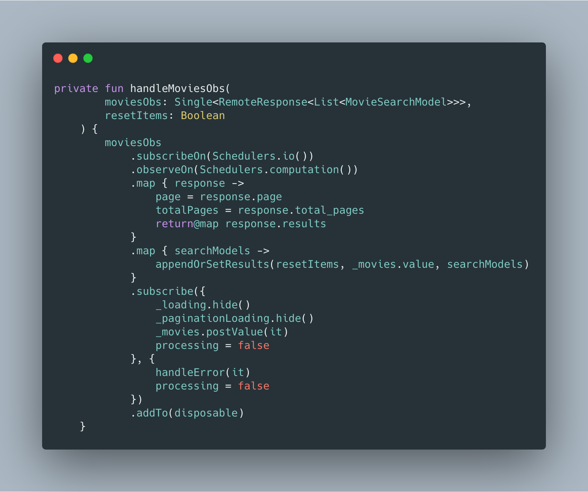
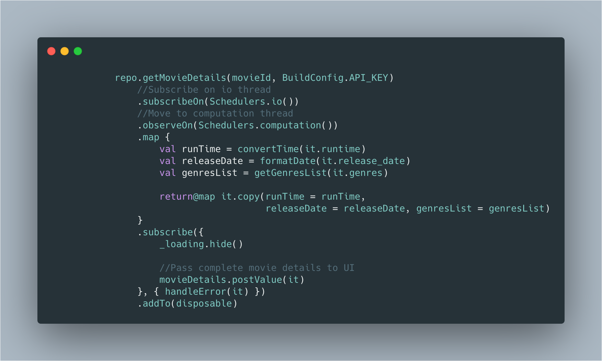
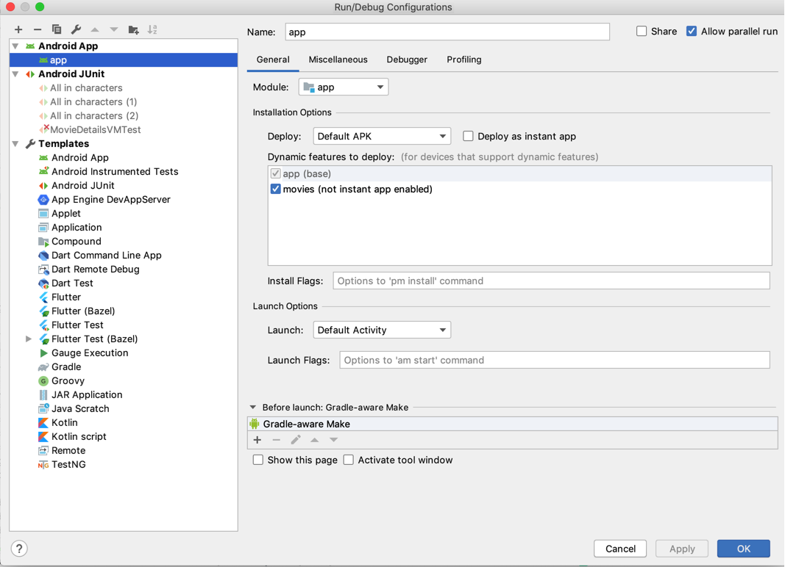

# Movies App Android

This sample app has been developed with Kotlin following an MVVM architecture pattern with a modular approach for **[Challenge](challenge.txt)** given by Neugelb Studios.

# Working
* Home screen: List movies by fetching from [themoviedb](https://developers.themoviedb.org/3/) with pagination, scroll to load more movies. 
* Search by Name: Just enter name of the movie and press search button or wait. 
* Details screen: List down movie details by fetching from [themoviedb](https://developers.themoviedb.org/3/).

<p align="center">
  
  
  
  
</p>
<br>
<br>

### Framework
* **[Koin](https://github.com/InsertKoinIO/koin)**: Dependency injection
* **[Reactive streams](https://github.com/ReactiveX/RxJava)**: Networking & Async.
* **[LiveData and ViewModel](https://developer.android.com/topic/libraries/architecture)**: Isolate business logic and maintain state.

### Decisions
* **Koin**: Koin is a simple powerful Dependency injection framework for Kotlin. Written in pure Kotlin using functional resolution only: no proxy, no code generation, no reflection!

* **Modular**: The app is developed with a modular approach to support following:

  * Faster gradle builds
  * Re-usability of common functionality across applications / modules
  * Easily pluggable into Instant apps
  * Better team work, as one person can have the sole responsibility of a module
  * Smoother git flows

# Project Structure
* `app` module is where the application initialises.
* `movie` dynamic module is where our all screens reside. 
* [`MovieActivity`](movies/src/main/java/com/neugelb/challenge/movies/view/MovieActivity.kt) holds the [`MovieSearchFragment`](movies/src/main/java/com/neugelb/challenge/movies/view/MovieSearchFragment.kt) & [`MovieDetailsFragment`](movies/src/main/java/com/neugelb/challenge/movies/view/MovieDetailsFragment.kt).
* The packages are created using MVVM pattern.

## Code Details

**1. Get Movies List**


**2. Get Movie details**



# Running
You will need a device / emulator with Android Oreo (API 27) and up.


# Testing
Test cases for the [`MovieSearchVM`](movies/src/test/java/com/neugelb/challenge/movies/search/MovieSearchVMTest.kt) & [`MovieDetailsVM`](movies/src/test/java/com/neugelb/challenge/movies/details/MovieDetailsVMTest.kt) have been implemented using 
* `junit` : A unit testing framework
* `robolectric` : A framework that brings fast and reliable unit tests to Android. 
* `mockitoKotlin` : A small library that provides helper functions to work with Mockito in Kotlin.
* `aacTesting` : Test helpers for LiveData

## Library reference resources:
1. themoviedb: [https://developers.themoviedb.org/3](https://developers.themoviedb.org/3/getting-started/introduction)
2. Koin: [https://github.com/InsertKoinIO/koin](https://github.com/InsertKoinIO/koin)
3.  Retrofit:[https://square.github.io/retrofit](https://square.github.io/retrofit/)
4. RxJava2: [https://github.com/ReactiveX/RxJava](https://github.com/ReactiveX/RxJava)
5. mockito-kotlin: [https://github.com/nhaarman/mockito-kotlin](https://github.com/nhaarman/mockito-kotlin)
6. Robolectric: [https://github.com/robolectric/robolectric](https://github.com/robolectric/robolectric)
7. Joda-time: [https://github.com/JodaOrg/joda-time](https://github.com/JodaOrg/joda-time)

## Credits
1. [Carbon](https://carbon.now.sh): Used to create beautiful images of source code.
2. [Convertio](https://convertio.co/mov-gif/): Used to convert app usage video to gif file. 
3. [makeareadme](https://www.makeareadme.com): Used to create readme file. 

## License
```
Licensed under the Apache License, Version 2.0
```